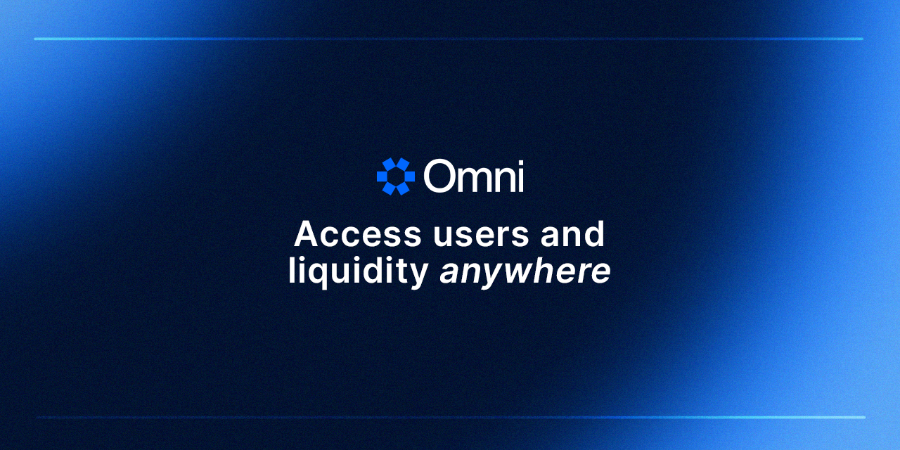

<h1 align="center">Omni Monorepo</h1>

<p align="center">
    <strong>Monorepo for Omni node, contracts and other related tools.</strong>
</p>

<p align="center">
    <a href="https://github.com/omni-network/omni/actions?query=workflow%3Aci-release">
        
    </a>
    <a href="https://github.com/omni-network/omni/actions?query=workflow%3Aci-main">
        
    </a>
    <a href="https://docs.omni.network/">
        
    </a>
    <a href="https://discord.com/channels/850218821398822922/1199003528824356935">
        
    </a>
    <a href="https://t.me/OmniFDN">
        
    </a>
    <a href="https://twitter.com/OmniFDN">
        
    </a>
</p>

<p align="center">
    <a href="https://omni.network/">
        
    </a>
</p>


## Table of Contents

- [About Omni](#about-omni)
- [Installation](#installation)
- [Usage](#usage)
- [Directory Structure](#directory-structure)
- [Contributing](#contributing)
- [Acknowledgements](#acknowledgements)
- [Security](#security)

## About Omni

Omni Protocol is a groundbreaking blockchain designed to seamlessly connect Ethereum's rollups, addressing the fragmentation issue in the ecosystem. It enables developers to create applications accessible across all rollups, simplifying user interaction and expanding the market reach for developers.

Key Features of Omni:

- **ETH Restaking**: Utilizes Ethereum validators through restaking, providing a robust security layer parallel to Ethereum, enhancing performance where Ethereum has limitations.
- **Fast Finality**: Offers quick transaction confirmations, crucial for a responsive user experience and mass adoption.
- **Cross-Rollup Programmability**: Empowers developers with a global state layer, allowing the creation of natively cross-rollup applications in a familiar EVM environment.

Omni Protocol stands as a vital infrastructure piece for Ethereum's future, offering a developer-friendly platform that combines security with performance, paving the way for a new era of dApp development.

## Installation

Building the node requires a working Go (version 1.22 or higher, see `go.mod`) and `goreleaser` ([see installation guide here](https://goreleaser.com/install/) or install with `make ensure-go-releaser`). You can install them using your favorite package manager. Once the dependencies are installed, run:

```bash
make build-docker
```

## Usage

### Testing

To run the end-to-end tests, run:

```bash
MANIFEST=devnet1 make e2e-run
```

### Starting a devnet

To start a devnet, run:

```bash
make devnet-deploy
```

To stop it, run:

```bash
make devnet-clean
```

## Directory Structure

<pre>
├── <a href="./contracts/">contracts</a>: Solidity contracts and related software.
│ ├── <a href="./core/">core/</a>: Core protocol smart contracts.
│ ├── <a href="./avs/">avs/</a>: Eigen AVS smart contracts.
│ ├── <a href="./bindings/">bindings/</a>: Go smart contract bindings.
│ └── <a href="./allocs/">allocs/</a>: Predeploy allocations.
├── <a href="./docs/">docs</a>: Documentation resources, including images and diagrams.
├── <a href="./halo/">halo</a>: The Halo instance, including application logic and attestation mechanisms.
│ ├── <a href="./halo/app/">app</a>: Application logic for Halo.
│ └── <a href="./halo/cmd/">cmd</a>: Command-line tools and utilities.
├── <a href="./lib/">lib</a>: Core libraries for various protocol functionalities.
│ ├── <a href="./lib/cchain/">cchain</a>: Consensus chain interaction utilities.
│ └── <a href="./lib/xchain/">xchain</a>: Cross-chain messaging and utilities.
├── <a href="./octane/">octane</a>: Octane is a modular framework for the EVM.
│ └── <a href="./octane/evmengine/">evmengine</a>: The EVMEngine cosmos module.
├── <a href="./relayer/">relayer</a>: Relayer service for cross-chain messages and transactions.
│ └── <a href="./relayer/app/">app</a>: Application logic for the relayer service.
├── <a href="./scripts/">scripts</a>: Utility scripts for development and operational tasks.
└── <a href="./test/">test</a>: Testing suite for end-to-end, smoke, and utility testing.
</pre>

## Contributing

For detailed instructions on how to contribute, including our coding standards, testing practices, and how to submit pull requests, please see [the contribution guidelines](./docs/contributing.md).

## Acknowledgements

The development of Omni has been a journey of learning, adaptation, and innovation. As we built Omni, we drew inspiration and knowledge from the work of several remarkable teams within the blockchain and Ethereum ecosystem.

We extend our gratitude to the following teams for their pioneering work and the open-source resources they've provided, which have significantly influenced our development process:

- [**CometBFT**](https://github.com/cometbft/cometbft): Our heartfelt thanks go to the CometBFT team for their groundbreaking work in consensus algorithms.

- [**Geth**](https://github.com/ethereum/go-ethereum): The go-ethereum team's relentless dedication to the Ethereum ecosystem has been nothing short of inspiring. Their comprehensive and robust implementation of the Ethereum protocol has provided us with a solid foundation to build upon.

- [**Erigon**](https://github.com/ledgerwatch/erigon): We are grateful to Erigon for their novel work in maximizing EVM performance.

- [**Optimism**](https://github.com/ethereum-optimism/optimism): We thank the Optimism team for their dedication to open source work within the Ethereum ecosystem.

Acknowledging these teams is not only a gesture of gratitude but also a reflection of our commitment to collaborative progress and the open-source ethos. The path they've paved has enabled us to contribute our innovations back to the community, and we look forward to continuing this tradition of mutual growth and support.

## Security

Please refer to [SECURITY.md](./SECURITY.md).
